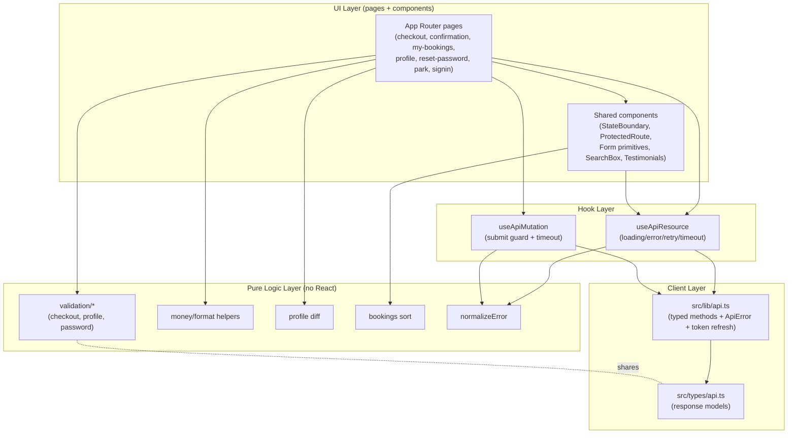
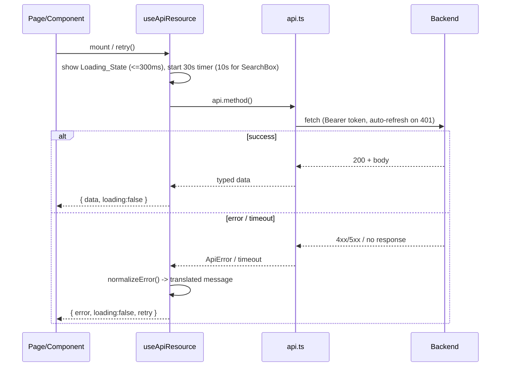
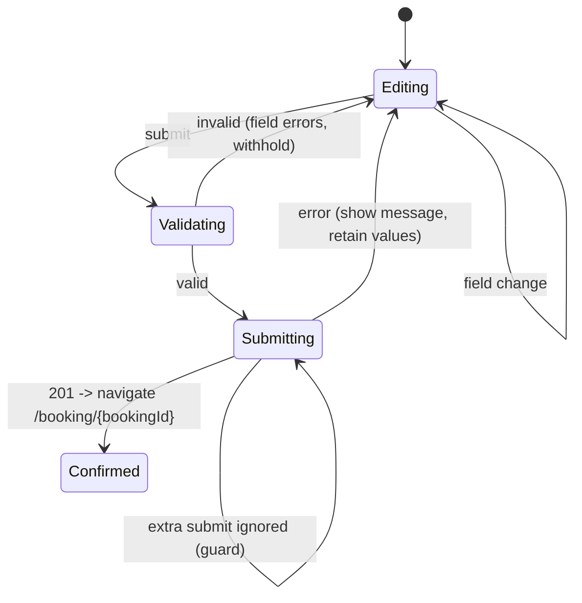

# Design Document — Frontend API Integration

## Overview

This feature delivers a complete, correct, and consistent connection between the CuratedLodges frontend (Next.js App Router + TypeScript + CSS modules) and the existing backend defined in `BACKEND_ARCHITECTURE.md`, reached through the typed client at `src/lib/api.ts`.

The work has two tracks:

1. **Audit-and-fix** the pages that are already wired to the API (Homepage, Basecamps, Field Notes list/detail, Park page, Lodge detail, SearchBox, Footer newsletter) so their request shapes, response field mappings, error handling, and loading behavior match the documented contract.
2. **Build the missing surfaces** for backend capabilities that currently have no UI: the checkout/booking flow, booking confirmation, booking cancellation, My Bookings, Profile/account, reset-password, Google/Facebook OAuth, the regions/parks search source, full park detail content, and real testimonials.

Every new surface must match the established `Theme_Conventions`: component-scoped CSS modules, DM Sans typography, the existing Header/Footer composition, `react-i18next` for all visible text, and the `LocalizationContext`/`AuthContext` providers. Shared infrastructure (a data-fetching hook, a protected-route guard, typed API response models, error normalization aligned with `ApiError`, and currency/language integration) underpins both tracks so loading and error states are uniform across the app.

### Design Goals

- **Contract fidelity** — request/response shapes are the single source of truth; the frontend never renders fields absent from the documented response.
- **Server-authoritative money** — booking totals come from the server; the client only formats them through `convertPrice`.
- **Uniform UX states** — every awaited request has a themed loading state and a translated, retryable (for reads) error state.
- **Non-regression** — audited pages keep their existing text, layout, and active language; only the data plumbing changes.
- **Pure, testable logic** — validation, formatting, diffing, and sorting live in pure helper modules that can be property-tested independently of React.

### Key Investigation Findings (current divergences)

The audit surfaced concrete mismatches against the contract that this design corrects:

- **Park page** (`/park/[region]/[park]`) calls only `getLodgesByPark` and reads a non-existent `data.parkName`; it never calls `getParkBySlug`, so park description, hero, features, and FAQs are absent (Req 10).
- **SearchBox** hardcodes regions (`india`, `africa`) instead of calling `getRegions`, and has no loading/error/empty states for regions or parks (Req 9).
- **Testimonials** renders hardcoded fallback data even when the API returns empty or errors, instead of omitting the section (Req 11).
- **Basecamps** swallows errors to `console.error` and renders an empty grid instead of an error state (Req 1.4); it uses a `forceUpdate({})` hack to react to currency changes.
- **Lodge detail** maps `jungloreStory.highlights` as a keyed object (`originStory`, `natureBlend`, …) but the contract defines it as an array of `{icon, text}`; it also reads `rt.totalUnits`, which is not in the lodge-detail room-type shape (Req 1.2, 1.3).
- **Sign-in / OAuth** social buttons are inert (no handlers), and successful sign-in does not sync `preferredLanguage`/`preferredCurrency` into `LocalizationContext` (Req 8, Req 15.5).
- **No checkout flow exists** — the lodge page has no booking entry point, and `createBooking`/`getBooking`/`cancelBooking`/`getMyBookings`/`getMe`/`updateMe`/`resetPassword` have no consuming UI.

## Architecture

### Layered View

The integration follows a four-layer separation so that pure logic is testable in isolation and React components stay thin.



### Provider Composition

Providers are already wired in `ClientProviders` (`LocalizationProvider` → `AuthProvider` → children + `LocalizationModal`). This design keeps that order and adds:

- A small **auth↔localization sync** effect: when `AuthContext` resolves a user with `preferredLanguage`/`preferredCurrency`, those values are pushed into `LocalizationContext` (Req 15.5). This is implemented as a dedicated effect rather than cross-importing contexts, to keep the providers decoupled.
- A `ProtectedRoute` guard component used by protected pages (it consumes `AuthContext`, no provider change needed).

### Request Lifecycle (read)



Writes use `useApiMutation`, which adds a single-flight submit guard (ignores re-entrant submits while in flight) and the same timeout/normalization, but never auto-retries (mutations are not idempotent on the client).

### Route and File Structure

New and modified files under `src/`:

```
src/
  app/
    checkout/
      page.tsx                         # Checkout_Flow (Req 2) — entered with ?lodge=&room=
      checkout.module.css
    booking/
      [bookingId]/
        page.tsx                       # Booking_Confirmation_Page (Req 3, 4) — Protected_Route
        booking.module.css
    my-bookings/
      page.tsx                         # My_Bookings_Page (Req 5) — Protected_Route
      mybookings.module.css
    profile/
      page.tsx                         # Profile_Page (Req 6) — Protected_Route
      profile.module.css
    reset-password/
      page.tsx                         # Reset_Password_Page (Req 7)
      resetpassword.module.css
    auth/
      callback/
        page.tsx                       # optional OAuth redirect landing (Req 8)
    park/[region]/[park]/page.tsx      # AUDIT/FIX: add getParkBySlug (Req 10)
    basecamps/page.tsx                 # AUDIT/FIX: error state (Req 1)
    signin/page.tsx                    # AUDIT/FIX: wire OAuth + lang/currency sync (Req 8, 15)

  components/
    feedback/
      LoadingState.tsx / .module.css   # themed spinner/skeleton (Req 13)
      ErrorState.tsx / .module.css     # message + optional retry (Req 13)
      EmptyState.tsx / .module.css     # translated empty message
      StateBoundary.tsx                # renders loading/error/empty/data uniformly
    auth/
      ProtectedRoute.tsx               # auth guard (Req 12)
      OAuthButtons.tsx                 # Google/Facebook controls (Req 8)
    form/
      Field.tsx, TextInput.tsx, FieldError.tsx, SubmitButton.tsx  # shared form primitives (Req 14.7)
      form.module.css
    domain/
      CheckoutForm.tsx / .module.css   # checkout form body (Req 2)
      NaturalistSessionPicker.tsx      # 0–20 sessions (Req 2.2)
      BookingSummary.tsx               # server totals via convertPrice (Req 2.4)
      BookingCard.tsx                  # used by My_Bookings_Page
      CancelBookingDialog.tsx          # confirm + cancel (Req 4)
      SearchBox.tsx                    # AUDIT/FIX: getRegions + states (Req 9)
      Testimonials.tsx                 # AUDIT/FIX: omit on empty/error (Req 11)

  hooks/
    useApiResource.ts                  # read fetch hook (Req 13)
    useApiMutation.ts                  # write hook + submit guard (Req 13)
    useProtectedRoute.ts               # redirect logic for guard (Req 12)

  lib/
    api.ts                             # EXTEND: loginWithGoogle, loginWithFacebook
    auth-redirect.ts                   # store/read post-login destination (Req 12.2/12.4)
    errors.ts                          # normalizeError(ApiError|unknown) -> i18n key + message
    money.ts                           # formatting guards around convertPrice

  logic/
    checkoutValidation.ts              # pure validators (Req 2.6/2.11/2.12)
    profileValidation.ts              # pure validators (Req 6.12)
    passwordValidation.ts              # pure validators (Req 7.4/7.5)
    profileDiff.ts                     # changed-fields diff (Req 6.3/6.4)
    bookingsSort.ts                    # sort by checkIn desc (Req 5.3)
    supported.ts                       # supported languages/currencies (Req 6.12, 15.6)

  types/
    api.ts                             # response models for every endpoint (Req 1, all)

  contexts/
    AuthContext.tsx                    # EXTEND: setUser from OAuth, expose for sync
    LocalizationContext.tsx            # EXTEND: exchange-rate-unavailable flag (Req 15.3)
```

The OAuth provider SDKs (Google Identity Services, Facebook SDK) are loaded client-side; their credentials/app IDs come from `NEXT_PUBLIC_*` env vars. The backend exchange endpoints (`POST /auth/google`, `POST /auth/facebook`) are the trust boundary — the frontend only forwards the provider credential.

## Components and Interfaces

### Shared Infrastructure

#### `useApiResource` (read hook) — Req 13

```typescript
interface ApiResourceState<T> {
  data: T | null;
  loading: boolean;
  error: NormalizedError | null;
  retry: () => void;
}

function useApiResource<T>(
  fetcher: () => Promise<T>,
  options?: {
    enabled?: boolean;        // gate the call (e.g., missing id => false)
    timeoutMs?: number;       // default 30000; SearchBox uses 10000
    deps?: unknown[];         // re-fetch on dependency change
  }
): ApiResourceState<T>;
```

Behavior:
- Sets `loading` true and shows the themed `LoadingState` within 300 ms; clears it when data or error arrives (Req 13.1).
- Races the fetch against `timeoutMs`; on timeout, ends loading and produces a timeout error (Req 13.3).
- On failure, runs `normalizeError` to derive a translated message; reads always expose `retry` (Req 13.6/13.7).
- `retry()` re-issues the request and swaps the error for a loading state (Req 13.7).
- When `enabled` is false, no call is made (used for Req 3.7 missing booking id, Req 7.2 missing token).

#### `useApiMutation` (write hook) — Req 2, 4, 6, 7, 8

```typescript
interface ApiMutationState<TArgs, TResult> {
  submit: (args: TArgs) => Promise<TResult | undefined>;
  submitting: boolean;
  error: NormalizedError | null;
  reset: () => void;
}
```

Behavior:
- **Single-flight guard:** while `submitting` is true, further `submit` calls are ignored and resolve to `undefined` (Req 2.7, 4.5, 6.5, 7.6, 8.6).
- Applies the same 30 s timeout and `normalizeError`; does **not** auto-retry.
- Never clears caller-entered form values; the page retains inputs on error (Req 2.9, 6.11, 7.8).

#### `normalizeError` (`lib/errors.ts`) — Req 13.2/13.4/13.5

```typescript
interface NormalizedError {
  kind: 'network' | 'timeout' | 'server' | 'unknown';
  messageKey: string;   // i18n key
  message: string;      // resolved fallback text
  status?: number;
}
function normalizeError(err: unknown): NormalizedError;
```

Maps `ApiError` (with `data.error`/`data.message`) to a server error using the response message (Req 13.4); a server error without a message resolves to a generic translated fallback (Req 13.5); a thrown `TypeError`/fetch failure becomes a `network` error (Req 13.2); timeouts become `timeout` (Req 13.3). All text resolves through `react-i18next` (Req 13.8).

#### `StateBoundary` — Req 13/14

A presentational wrapper used by every awaited surface:

```tsx
<StateBoundary
  loading={state.loading}
  error={state.error}
  empty={isEmpty}
  onRetry={state.retry}        // omitted for non-read flows
  emptyMessageKey="..."
>
  {children /* rendered only when data is present and non-empty */}
</StateBoundary>
```

It guarantees consistent loading/error/empty rendering and that partial/placeholder data is never shown alongside an error (Req 1.4, 5.6, 10.7).

#### `ProtectedRoute` — Req 12

```tsx
<ProtectedRoute>{children}</ProtectedRoute>
```

Consumes `AuthContext`:
- While `isLoading` is true, renders a `LoadingState` and withholds children (Req 12.1); a 10 s ceiling treats unresolved auth as unauthenticated (Req 12.6).
- If resolved with no user, stores the current path via `auth-redirect.ts` and redirects to `/signin` (Req 12.2).
- If resolved with a user, renders children (Req 12.3).
- The sign-in page reads the stored path after successful login and navigates there (Req 12.4).
- On a post-refresh 401 from a protected request, `AuthContext` clears the user (existing refresh logic in `api.ts` clears tokens) and the guard redirects (Req 12.5).

#### `OAuthButtons` — Req 8

```tsx
<OAuthButtons onSuccess={(authResult) => void} redirectTo={string} />
```

- Requests a Google/Facebook credential via the provider SDK; if the user cancels or no credential returns, it shows an error and does **not** call the backend (Req 8.3).
- On credential, calls `api.loginWithGoogle(idToken)` / `api.loginWithFacebook(accessToken)` through `useApiMutation` (30 s timeout, disabled controls while in flight) (Req 8.1/8.2/8.6/8.7).
- On success, stores tokens, sets the `AuthContext` user, and navigates to `redirectTo` (Req 8.4/8.5).
- On error, shows a derived message, stores no tokens, stays on the view, and re-enables controls (Req 8.8).
- Rendered on both sign-in and sign-up views using the existing `.socialButton` styling (Req 8.9).

#### Form Primitives — Req 14.7

`Field`, `TextInput`, `FieldError`, `SubmitButton` extract the exact label/input/validation/button markup and classes used by the sign-in and forgot-password pages into reusable components so new forms (checkout, profile, reset-password) reuse the same layout and CSS-module conventions.

### API Client Extensions (`src/lib/api.ts`)

Two methods are added, mirroring the existing style:

```typescript
loginWithGoogle: (idToken: string) =>
  request('/auth/google', { method: 'POST', body: JSON.stringify({ idToken }) }),
loginWithFacebook: (accessToken: string) =>
  request('/auth/facebook', { method: 'POST', body: JSON.stringify({ accessToken }) }),
```

All other methods already match the contract and are reused as-is. The audit verifies each call site uses the correct method/path/body.

### Page Components (new surfaces)

| Component | Endpoint(s) | Key responsibilities | Requirements |
|-----------|-------------|----------------------|--------------|
| `CheckoutPage` + `CheckoutForm` | `createBooking` | Collect room/dates/guests/sessions, client validate, submit with `currencyPaid`, navigate to confirmation | 2 |
| `BookingConfirmationPage` | `getBooking`, `cancelBooking` | Show server booking details + totals; cancel action | 3, 4 |
| `MyBookingsPage` | `getMyBookings` | List sorted desc by check-in; navigate to detail | 5 |
| `ProfilePage` | `getMe`, `updateMe` | View/edit profile; diff changed fields; sync lang/currency | 6, 15 |
| `ResetPasswordPage` | `resetPassword` | Read token from URL; validate; submit | 7 |
| `SearchBox` (fix) | `getRegions`, `getParksByRegion` | Real regions/parks with states | 9 |
| `ParkPage` (fix) | `getParkBySlug`, `getLodgesByPark` | Park content + lodge grid | 10 |
| `Testimonials` (fix) | `getTestimonials` / homepage bundle | Omit on empty/error; placeholder image | 11 |

### Checkout Flow Detail — Req 2



- Entry: from the lodge detail page, a "Book this lodge" action navigates to `/checkout?lodge={slug}&room={roomTypeId}`; the page fetches lodge detail (`getLodgeBySlug`) to populate room types and naturalists.
- Collected fields: room type, check-in, check-out, adults (≥1), children (≥0), guest first/last name, email, phone, optional special requests (Req 2.1).
- Naturalist sessions: 0–20 entries, each with naturalist, session date within `[checkIn, checkOut]`, and count 1–20 (Req 2.2).
- Authenticated users get guest first/last/email pre-filled from `AuthContext` (Req 2.10).
- Validation runs through `logic/checkoutValidation.ts` before submit (Req 2.6/2.11/2.12); the request body matches `POST /bookings` and includes the active `currencyPaid` (Req 2.3, 15.8).
- `BookingSummary` displays only the server-returned `roomTotal`, `experienceTotal`, `taxAmount`, `totalAmount` as authoritative, each through `convertPrice` (Req 2.4/2.5). Client-side estimates, if shown pre-submit, are clearly labeled and never sent.

### Booking Confirmation / Cancellation Detail — Req 3, 4

- Reads `bookingId` from the route; if absent, withholds `getBooking` and shows an error (Req 3.7).
- Renders human-readable booking ID, lodge name, room type, dates, nights, all totals, adults/children, booking status, payment status (Req 3.2); `held` shows the returned pending-payment status (Req 3.5). All money via `convertPrice` (Req 3.6).
- Cancel is shown only when the returned status is cancellable and the viewer owns the booking (Req 4.1). Invoking it opens `CancelBookingDialog`; `cancelBooking` is called only on explicit confirm (Req 4.2/4.3). Success updates the displayed status, shows the refund message, and removes the cancel action (Req 4.4). The confirm button is single-flight with a 30 s timeout that re-enables the action on timeout (Req 4.5/4.7). Errors leave status/details unchanged (Req 4.6).

### Profile Flow Detail — Req 6

- `getMe` populates the form; absent/null fields render as empty, never the literal `"null"`/`"undefined"` (Req 6.2).
- `profileDiff.ts` computes the changed subset; `updateMe` is called with only changed fields, and is withheld entirely when nothing changed (Req 6.3/6.4).
- On success, a confirmation persists ≥3 s and updated values render (Req 6.6); a returned `preferredLanguage`/`preferredCurrency` is pushed to `LocalizationContext` (Req 6.7/6.8).
- Validation via `profileValidation.ts`: name ≤100 chars, phone 7–15 digits, language/currency among supported options (Req 6.12).

### SearchBox / Park / Testimonials Fixes

- **SearchBox:** `getRegions` on mount populates regions by `{name, slug}`; selecting a region calls `getParksByRegion(slug)` and replaces park options; per-control loading disables the control; errors show a retryable message and keep prior options; empty lists show an empty state; 10 s timeout (Req 9). Navigation only when both selected; otherwise field-level error (Req 9.5/9.6).
- **Park page:** calls both `getParkBySlug` (name, description, hero, bestTime, features, FAQs) and `getLodgesByPark` (grid); missing optional content (best time/features/FAQs) degrades gracefully; lodge-grid error renders alongside intact park content; park-not-found shows a retryable error (Req 10).
- **Testimonials:** prefers homepage-bundle testimonials, else calls `getTestimonials`; renders name/company/text/image per item; omits the section entirely on error or zero items (no fallback data); missing image uses a placeholder (Req 11).

## Data Models

All response models live in `src/types/api.ts` and mirror `BACKEND_ARCHITECTURE.md` exactly (camelCase as returned by the API). These types are the contract enforcement mechanism: components consume typed fields, so referencing an undocumented field is a compile error (Req 1.2/1.3).

### Auth & User

```typescript
export interface AuthUser {
  id: string;
  email: string;
  firstName: string;
  lastName: string;
  preferredLanguage?: string;   // present on login/google/facebook
  preferredCurrency?: string;
}
export interface AuthResponse {
  user: AuthUser;
  token: string;
  refreshToken: string;
}
export interface MeResponse {
  id: string;
  email: string;
  firstName: string;
  lastName: string;
  phone?: string | null;
  avatarUrl?: string | null;
  whatsappEnabled: boolean;
  preferredLanguage: string;
  preferredCurrency: string;
  emailVerified: boolean;
}
export interface UpdateMeRequest {
  firstName?: string;
  lastName?: string;
  phone?: string;
  whatsappEnabled?: boolean;
  preferredLanguage?: string;
  preferredCurrency?: string;
}
```

### Regions, Parks, Lodges

```typescript
export interface Region { id: string; name: string; slug: string; }
export interface ParkSummary {
  id: string; name: string; slug: string; heroImage: string; lodgeCount: number;
}
export interface ParkFeature { icon: string; name: string; }
export interface ParkFaq { question: string; answer: string; }
export interface ParkDetail {
  id: string; name: string; slug: string; description: string; heroImage: string;
  bestTime?: string; wildlife?: string;
  features: ParkFeature[]; faqs: ParkFaq[];
  region: { name: string; slug: string };
}
export interface LodgeListItem {
  id: string; name: string; slug: string; thumbnail: string;
  images?: string[]; rating: number; pricePerNight?: number; minRoomPrice?: number;
  location: string; nearestGates?: string[]; amenities?: string[]; ecoCertified?: boolean;
  parkName?: string; parkSlug?: string; regionSlug?: string; about?: string;
}
```

### Lodge Detail (booking source)

```typescript
export interface RoomType {
  id: string; name: string; price: number; image: string;
  description?: string; amenities?: string[]; maxOccupancy?: number;
}
export interface Naturalist {
  id: string; name: string; role: string; experience?: string;
  specialty?: string; pricePerSession: number; image?: string;
}
export interface LodgeDetail {
  id: string; name: string; slug: string; thumbnail: string;
  images: { url: string; altText?: string }[];
  rating: number; pricePerNight: number; location: string;
  nearestGates?: string[]; amenities?: string[]; ecoCertified?: boolean; externalLink?: string;
  about?: { description: string[] };
  jungloreStory?: { reasons: string[]; highlights: { icon: string; text: string }[] };
  roomTypes: RoomType[];
  naturalists: Naturalist[];
  bankOffers?: BankOffer[];
  faqs?: { question: string; answer: string }[];
  park: { name: string; slug: string; region: { name: string; slug: string } };
}
```

> Note: the existing lodge page must be corrected to treat `jungloreStory.highlights` as `{icon, text}[]` and to stop reading `roomTypes[].totalUnits`, which the contract does not return.

### Bookings

```typescript
export interface NaturalistSessionInput {
  naturalistId: string;
  sessionDate: string;   // YYYY-MM-DD, within [checkIn, checkOut]
  numSessions: number;   // 1..20
}
export interface CreateBookingRequest {
  lodgeId: string;
  roomTypeId: string;
  checkIn: string;       // YYYY-MM-DD
  checkOut: string;      // YYYY-MM-DD
  adults: number;        // >= 1
  children: number;      // >= 0
  guest: {
    firstName: string; lastName: string; email: string; phone: string;
    whatsappEnabled?: boolean; specialRequests?: string;
  };
  naturalistSessions?: NaturalistSessionInput[];  // 0..20
  currencyPaid: string;  // active currency code
}
export type BookingStatus =
  | 'held' | 'pending' | 'confirmed' | 'cancelled' | 'completed' | 'no_show';
export type PaymentStatus =
  | 'pending' | 'paid' | 'partially_paid' | 'refunded' | 'failed';

export interface Booking {
  id: string;
  bookingId: string;            // human-readable, e.g. "JL12345678"
  lodge: { id?: string; name: string; thumbnail?: string };
  roomType: { name: string; price?: number };
  checkIn: string; checkOut: string; numNights: number;
  adults: number; children: number;
  roomTotal: number; experienceTotal: number; taxAmount: number; totalAmount: number;
  status: BookingStatus; paymentStatus: PaymentStatus;
  guestEmail?: string; createdAt?: string;
}
export interface MyBookingsResponse {
  bookings: Booking[];
  pagination?: { page: number; limit: number; total: number; totalPages: number };
}
export interface CancelBookingResponse {
  bookingId: string; status: BookingStatus;
  refundAmount?: number; message: string;
}
```

`CANCELLABLE_STATUSES = ['held', 'pending', 'confirmed']` (statuses for which the cancel action is offered, Req 4.1).

### Field Notes, Testimonials, Newsletter, Homepage

```typescript
export interface FieldNoteListItem {
  id: string; slug: string; title: string; excerpt: string;
  author: string; park: string; image: string; publishedDate: string; readTime: string;
}
export interface FieldNotesResponse {
  fieldNotes: FieldNoteListItem[];
  filters: { parks: string[] };
  pagination: { page: number; limit: number; total: number; totalPages: number };
}
export interface FieldNoteDetail extends Omit<FieldNoteListItem, 'excerpt'> {
  excerpt: string; content: string[];
  relatedNotes: { id: string; slug: string; title: string; park: string; image: string }[];
}
export interface Testimonial {
  id: string; name: string; company?: string; text: string; image?: string;
}
export interface HomepageResponse {
  hero: { imageUrl: string; videoUrl: string | null };
  featuredLodges: LodgeListItem[];
  latestFieldNotes: { id: string; slug: string; title: string; author: string; park: string; image: string }[];
  testimonials: Testimonial[];
}
```

### Supported Options & Defaults (`logic/supported.ts`)

```typescript
export const SUPPORTED_LANGUAGES = ['en','en-GB','es','es-MX','fr','de','it','pt','pt-BR','ja','zh','hi'];
export const SUPPORTED_CURRENCIES = ['INR','USD','EUR','GBP','AUD','CAD','JPY','CNY','CHF','SGD','AED','THB','MYR'];
export const DEFAULT_LANGUAGE = 'en';   // Req 15.6
export const DEFAULT_CURRENCY = 'INR';  // Req 15.6
```

These derive from `i18n/config.ts` and the `getCurrencySymbol` map in `LocalizationContext`, keeping the validators aligned with what the app can actually render.

## Correctness Properties

*A property is a characteristic or behavior that should hold true across all valid executions of a system — essentially, a formal statement about what the system should do. Properties serve as the bridge between human-readable specifications and machine-verifiable correctness guarantees.*

These properties target the pure logic layer (`src/logic`, `src/lib`) and the framework-agnostic behavior of the shared hooks/components, which is where input variation meaningfully exposes bugs. Page wiring, rendering, and provider/SDK integration are covered by example/integration/snapshot tests in the Testing Strategy instead. The prework's deduplication has been applied so each property is unique.

### Property 1: Price formatting prefixes the currency symbol and scales by the exchange rate

*For any* non-negative price amount, any supported currency, and any non-negative exchange rate, `convertPrice` returns a string that begins with that currency's symbol and encodes the amount multiplied by the exchange rate rounded to a whole number; with currency INR and rate 1, the encoded number equals the input amount.

**Validates: Requirements 1.7, 2.5, 3.6, 5.9, 10.5, 15.1**

### Property 2: Checkout validation accepts a form state if and only if all field rules hold

*For any* generated checkout form state, `validateCheckout` reports `isValid = true` exactly when every required field (room type, check-in, check-out, guest first name, last name, email, phone) is non-empty, adults ≥ 1, children ≥ 0, the email matches a valid email format, check-in is not before today, and check-out is strictly after check-in; otherwise it reports `isValid = false` and flags precisely the violated fields.

**Validates: Requirements 2.6, 2.11, 2.12**

### Property 3: Naturalist sessions validate against count and date-range bounds

*For any* generated list of naturalist sessions and any valid check-in/check-out range, `validateSessions` accepts the list if and only if its length is between 0 and 20 inclusive and every session has a session date within `[checkIn, checkOut]` and a session count between 1 and 20 inclusive.

**Validates: Requirements 2.2**

### Property 4: The createBooking request body is well-formed and carries the active currency

*For any* valid checkout form state and any active currency code, `buildCreateBookingRequest` produces an object containing exactly the documented keys (`lodgeId`, `roomTypeId`, `checkIn`, `checkOut`, `adults`, `children`, `guest`, optional `naturalistSessions`, `currencyPaid`) where `currencyPaid` equals the active currency code and the `guest` object contains the entered guest fields.

**Validates: Requirements 2.3, 15.8**

### Property 5: My Bookings sort is a descending permutation by check-in date

*For any* list of bookings, `sortByCheckInDesc` returns a list that is a permutation of the input (same multiset of bookings) and is ordered so that each booking's check-in date is greater than or equal to the next booking's check-in date.

**Validates: Requirements 5.3**

### Property 6: Profile diff yields exactly the changed fields

*For any* original profile object and any edited profile object over the editable fields (first name, last name, phone, WhatsApp preference, preferred language, preferred currency), `diffProfile` returns an object whose keys are exactly the fields whose edited value differs from the original, with each value equal to the edited value; when no field differs, the result is empty.

**Validates: Requirements 6.3, 6.4**

### Property 7: Profile validation accepts a profile if and only if all field rules hold

*For any* generated profile submission, `validateProfile` reports valid exactly when first name and last name are each at most 100 characters, the phone contains between 7 and 15 digits inclusive, and the preferred language and preferred currency are each among the supported options; otherwise it reports invalid and flags precisely the violated fields.

**Validates: Requirements 6.12**

### Property 8: Display normalization never leaks null or undefined literals

*For any* field value (including `null`, `undefined`, numbers, and arbitrary strings), `displayValue` returns a string that is never the literal `"null"` or `"undefined"`, and returns the empty string when the input is `null` or `undefined`.

**Validates: Requirements 6.2**

### Property 9: Password reset validation accepts a password if and only if length and confirmation rules hold

*For any* generated password and confirmation pair, `validateResetPassword` reports valid exactly when the password length is between 8 and 128 characters inclusive and the password equals its confirmation; otherwise it reports invalid and flags whichever rule (length and/or mismatch) is violated.

**Validates: Requirements 7.4, 7.5**

### Property 10: Preference resolution always yields a supported language and currency

*For any* candidate preferred language and preferred currency (including absent, null, or unsupported values), `resolvePreferences` returns a language that is among the supported languages and a currency that is among the supported currencies, falling back to `en` and `INR` respectively when the candidate is absent or unsupported.

**Validates: Requirements 15.5, 15.6**

### Property 11: Language and currency persistence round-trips

*For any* supported language and supported currency, persisting the value and then loading it from storage returns the same value.

**Validates: Requirements 15.7**

### Property 12: Search submission is enabled if and only if both region and park are selected

*For any* region selection and park selection, `canSubmitSearch` returns true exactly when both the region and the park are non-empty selections.

**Validates: Requirements 9.6**

### Property 13: Booking cancel is offered if and only if status is cancellable and the viewer is the owner

*For any* booking status and ownership flag, `canCancelBooking` returns true exactly when the status is one of the cancellable statuses (`held`, `pending`, `confirmed`) and the viewer is the booking's owner.

**Validates: Requirements 4.1**

### Property 14: Testimonials section visibility depends only on success and non-empty data

*For any* fetch state and testimonial list, `shouldRenderTestimonials` returns true exactly when there is no error and the list contains at least one testimonial; otherwise the section is omitted.

**Validates: Requirements 11.4, 11.5**

### Property 15: Testimonial image resolution is always non-empty

*For any* testimonial, `resolveTestimonialImage` returns a non-empty image URL, substituting the placeholder image when the testimonial has no image value.

**Validates: Requirements 11.6**

### Property 16: Error normalization derives the right message for each failure kind

*For any* failure input, `normalizeError` produces a non-empty user-readable message such that: an `ApiError` carrying a response error/message text yields that text; an `ApiError` without any message yields a generic fallback; and a network/fetch failure yields a network-error message. In all cases the resulting message is non-empty.

**Validates: Requirements 13.2, 13.4, 13.5**

### Property 17: StateBoundary never renders data children while an error is present

*For any* combination of loading, error, empty, and data inputs, `StateBoundary` renders exactly one of the loading, error, empty, or data regions, and never renders the data children when an error is present.

**Validates: Requirements 1.4, 5.6**

### Property 18: useApiResource shows then clears a single loading state

*For any* fetcher that eventually resolves or rejects, `useApiResource` enters a loading state and then transitions to exactly one terminal state (data or error), never reporting `loading` simultaneously with a terminal result.

**Validates: Requirements 13.1**

### Property 19: A non-responding request produces a timeout error after the configured timeout

*For any* configured timeout value and a fetcher that never settles, the hook ends the loading state and produces a timeout error once the timeout elapses.

**Validates: Requirements 4.7, 5.7, 8.7, 9.8, 13.3**

### Property 20: Read errors expose a retry that re-issues the request

*For any* read resource whose fetcher first fails, `useApiResource` exposes a `retry` action; invoking it replaces the error with a loading state and calls the fetcher again.

**Validates: Requirements 13.6, 13.7**

### Property 21: A disabled resource never calls its fetcher

*For any* `useApiResource` configured with `enabled = false` (e.g., missing booking id or missing reset token), the fetcher is never invoked.

**Validates: Requirements 3.7**

### Property 22: In-flight mutations invoke the underlying request at most once

*For any* number of submit activations issued while a mutation is in flight, `useApiMutation` invokes the underlying request at most once until it settles.

**Validates: Requirements 2.7, 4.5, 6.5, 7.6, 8.6**

### Property 23: Protected content renders if and only if auth is resolved and authenticated

*For any* authentication state, `ProtectedRoute` renders its children exactly when the authentication state is resolved and a user is present; while unresolved it withholds children, and when resolved with no user it withholds children and triggers a redirect.

**Validates: Requirements 12.1, 12.3**

### Property 24: Post-login redirect path round-trips

*For any* route path, storing it as the post-login destination and then reading it returns the same path; when no path was stored, reading returns the default destination.

**Validates: Requirements 12.4**

## Error Handling

Error handling is centralized so every surface behaves identically (Req 13).

### Sources and normalization

- The client (`api.ts`) already throws `ApiError(message, status, data)` on non-2xx and performs one token refresh on a 401 before retrying. This design keeps that behavior and builds on it.
- `normalizeError(err)` maps any thrown value into a `NormalizedError`:
  - `ApiError` with `data.error`/`data.message` → `kind:'server'`, message derived from the response (Req 13.4).
  - `ApiError` without a message → `kind:'server'`, generic translated fallback (Req 13.5).
  - `TypeError`/fetch rejection → `kind:'network'`, network message (Req 13.2).
  - Hook-level timeout → `kind:'timeout'`, timeout message (Req 13.3).
- All messages are i18n keys resolved via `react-i18next`, with `fallbackLng: 'en'` guaranteeing default-locale text when a key is missing in the active locale (Req 13.8, 14.6).

### Presentation rules

| Scenario | Behavior | Requirements |
|----------|----------|--------------|
| Read failure (GET) | `ErrorState` with message + retry; retry re-issues and swaps to loading | 13.6, 13.7 |
| Write failure (POST/PATCH) | `ErrorState` with message, no retry; caller-entered values retained | 2.9, 4.6, 6.11, 7.8, 8.8 |
| Timeout (30 s; 10 s for SearchBox) | End loading, timeout `ErrorState`, re-enable action | 4.7, 5.7, 8.7, 9.8, 13.3 |
| Malformed/empty/partial response | `StateBoundary` shows error/empty; never partial data | 1.4, 5.6, 10.7 |
| Auth failure after refresh | `AuthContext` clears user; guard redirects to `/signin` | 12.5 |
| Exchange-rate fetch failure | Fallback rate 1, "rate unavailable" indicator, amounts retained, no crash | 15.3 |

### Auth & token handling

- Tokens remain in `localStorage` under `cl_token`/`cl_refresh_token`, managed solely by `api.ts` (`setTokens`/`clearTokens`). OAuth success funnels through `setTokens` + `AuthContext` user-set so there is a single token-storage path.
- Security note: the frontend never validates OAuth credentials itself; it forwards the provider token to the backend exchange endpoint, which is the trust boundary. No client-side authorization decisions are made beyond route gating for UX.

### Booking hold expiry

A `held` booking can expire server-side (15-minute `held_until`). The confirmation page displays whatever status the server returns on each load/retry; the frontend does not run its own countdown or mutate status locally (Req 3.5).

## Testing Strategy

### Dual approach

- **Property-based tests** validate the 24 universal properties above against the pure logic and framework-agnostic hook/component behavior.
- **Example/unit tests** validate concrete wiring: each page issues the documented endpoint/method/body (mocked client), maps documented fields, pre-fills, navigates, and gates calls.
- **Integration tests** validate provider/SDK seams: OAuth SDK → backend exchange → `AuthContext`; auth↔localization sync on sign-in; protected-route redirect round-trip.
- **Snapshot/style tests** validate Theme_Conventions: Header/Footer presence, form-primitive reuse, CSS-module-only styling.

### Tooling

- **Test runner:** Vitest (works with the existing Next.js/TypeScript setup) with React Testing Library for component behavior. Run via `vitest --run` (single execution, not watch mode).
- **Property-based library:** `fast-check` (the standard choice for TypeScript). Do not hand-roll generators/shrinking.
- Mock the API client and provider SDKs; use fake timers for timeout/3-second-confirmation tests.

### Property test requirements

- Each property is implemented by exactly one property-based test.
- Each property test runs a minimum of 100 iterations (`fc.assert(fc.property(...), { numRuns: 100 })`).
- Each property test is tagged with a comment referencing its design property in the format:
  **Feature: frontend-api-integration, Property {number}: {property text}**
- Generators cover edge cases called out in the prework: empty/whitespace strings, boundary lengths (100-char names, 7/15-digit phones, 8/128-char passwords), 0 and 20 session counts, dates on the check-in/check-out boundaries, unsupported language/currency codes, `null`/`undefined` field values, and empty collections.

### Example/integration coverage (non-PBT criteria)

| Area | Criteria | Test type |
|------|----------|-----------|
| Endpoint/method/body conformance per page | 1.1, 1.2, 1.3, 1.5, 2.1, 3.1, 5.1, 9.1, 9.2, 10.1 | Example (mock client) |
| Navigation & pre-fill | 2.8, 2.10, 5.8, 8.5, 9.5, 7.3 | Example (mock router) |
| Cancellation interaction (confirm gate) | 4.2, 4.3, 4.4, 4.6 | Example |
| OAuth SDK seam & guards | 8.1, 8.2, 8.3, 8.4, 8.8, 8.9 | Integration |
| Localization sync & timing | 6.7, 6.8, 15.2, 15.3, 15.4 | Integration (fake timers) |
| Confirmation persists ≥3 s | 6.6 | Example (fake timers) |
| Protected redirect & post-refresh 401 | 12.2, 12.5, 12.6 | Integration |
| Graceful degradation of sparse park content | 10.4, 10.8 | Edge-case render |
| Empty states | 5.5, 9.7 | Example render |
| Theme/styling/i18n | 1.6, 7.9, 13.8, 14.x | Snapshot/style/lint |
| CSS-module-only / font fallback | 14.1, 14.3 | Smoke/lint |

## Requirements Traceability

Each design component mapped back to the requirements it satisfies.

| Design component | Requirements satisfied |
|------------------|------------------------|
| Audit-and-fix: contract conformance pass across Homepage, Basecamps, Field Notes, Park, Lodge detail, SearchBox, Footer newsletter | 1.1, 1.2, 1.3, 1.4, 1.5, 1.6, 1.7 |
| `types/api.ts` response models (compile-time field enforcement) | 1.2, 1.3, and field mapping for all data pages |
| `CheckoutPage` + `CheckoutForm` + `NaturalistSessionPicker` + `BookingSummary` | 2.1–2.12, 15.8 |
| `logic/checkoutValidation.ts` (+ session validation, body builder) | 2.2, 2.3, 2.6, 2.11, 2.12 |
| `BookingConfirmationPage` | 3.1–3.7 |
| `CancelBookingDialog` + `canCancelBooking` predicate | 4.1–4.7 |
| `MyBookingsPage` + `bookingsSort.ts` + `BookingCard` | 5.1–5.9 |
| `ProfilePage` + `profileValidation.ts` + `profileDiff.ts` + `displayValue` | 6.1–6.12 |
| Auth↔Localization sync effect + `resolvePreferences` | 6.7, 6.8, 15.5, 15.6 |
| `ResetPasswordPage` + `passwordValidation.ts` | 7.1–7.9 |
| `OAuthButtons` + `api.loginWithGoogle/loginWithFacebook` | 8.1–8.9 |
| `SearchBox` (fixed) + `canSubmitSearch` | 9.1–9.8 |
| `ParkPage` (fixed) using `getParkBySlug` + `getLodgesByPark` | 10.1–10.8 |
| `Testimonials` (fixed) + `shouldRenderTestimonials` + `resolveTestimonialImage` | 11.1–11.6 |
| `ProtectedRoute` + `useProtectedRoute` + `auth-redirect.ts` | 12.1–12.6 |
| `useApiResource` / `useApiMutation` / `StateBoundary` / `LoadingState` / `ErrorState` / `EmptyState` | 13.1–13.8 |
| `normalizeError` (`lib/errors.ts`) | 13.2, 13.4, 13.5 |
| Form primitives, Header/Footer composition, CSS-module conventions, i18n usage | 14.1–14.7 |
| `LocalizationContext` integration (`convertPrice`, rate-unavailable flag, persistence) + `money.ts` | 15.1–15.8 |

### Property-to-requirement coverage summary

Properties 1–24 collectively validate the testable logic behind Requirements 1.4, 1.7, 2.2, 2.3, 2.5, 2.6, 2.7, 2.11, 2.12, 3.6, 3.7, 4.1, 4.5, 4.7, 5.3, 5.6, 5.7, 5.9, 6.2, 6.3, 6.4, 6.5, 6.9, 6.10, 7.4, 7.5, 7.6, 8.6, 8.7, 9.3, 9.6, 9.8, 10.5, 10.6, 11.3, 11.4, 11.5, 11.6, 12.1, 12.3, 12.4, 12.6, 13.1, 13.2, 13.3, 13.4, 13.5, 13.6, 13.7, 15.1, 15.5, 15.6, 15.7, 15.8. Remaining criteria are covered by the example/integration/snapshot/smoke tests enumerated in the Testing Strategy.
